# CurioLab — Architecture Decisions

**Status:** Accepted for PoC  
**Date:** 2026-09-07  

## Architecture diagram

```mermaid
flowchart TB
  subgraph CONSTRAINTS["Permanent Product Constraints"]
    SINGLE["Single-player only"]
    LEVELS["Independent challenge levels"]
    NO_ECS["No ECS architecture"]
  end

  subgraph UX["Delivery Layer"]
    WEB["Vanilla TypeScript Web App"]
    BUILD_UI["Simple Build Editor"]
    HUD["Challenge HUD"]
    DEBUG_UI["Developer Event Log Viewer"]
  end

  subgraph APP["Application Layer"]
    BUILD_APP["Machine Building Application"]
    CHALLENGE_APP["Challenge Application"]
    SIM_APP["Simulation Orchestrator"]
    EVENT_APP["Event Log Application"]
  end

  subgraph BUILD["Bounded Context: Machine Building — Core Domain"]
    MACHINE["Machine Aggregate"]
    PARTS["Part Instances"]
    CONNECTIONS["Socket Connections"]
    CONTROLS["Control Bindings"]
    CATALOG_PORT["Part Catalog Port"]
  end

  subgraph CHALLENGE["Bounded Context: Challenge — Supporting Domain"]
    CHALLENGE_DEF["Challenge Definition"]
    LANDSCAPE_DEF["Landscape Definition"]
    EVALUATOR["Challenge Evaluator"]
    OBJECTIVES["Start · Goal · Failure Rules"]
  end

  subgraph SIM["Simulation Kernel — Technical Domain"]
    COMPILER["Simulation Compiler"]
    SESSION["Simulation Session"]
    CLOCK["Fixed-step Clock 1/60"]
    PHYSICS_PORT["Physics World Port"]
    SIM_EVENTS["Semantic Simulation Events"]
  end

  subgraph EVENTS["Mandatory Event Log"]
    EVENT_BUS["Namespaced Dynamic Event Bus"]
    EVENT_SCHEMA["Event Schema Registry + Upcasters"]
    DEV_SINK["Console + In-memory Sink"]
    PERSISTENT_SINK["Persistent Sink Port"]
    TRACE["Generic Correlation Timeline"]
  end

  subgraph ADAPTERS["Infrastructure Adapters"]
    THREE["Direct Three.js Adapter"]
    RAPIER["Rapier Physics Adapter"]
    BUNDLED_LEVELS["Bundled Level Repository"]
    LOCAL_STORE["Local Storage Adapter"]
    KEYBOARD["Keyboard Input Adapter"]
  end

  subgraph ASSETS["Mandatory 3D Asset Pipeline"]
    IMG2THREE["img2threejs"]
    GENERATED["Generated THREE.Group Factories"]
    ASSET_ADAPTER["Part Visual Adapter"]
    PART_MANIFEST["Versioned Part Manifest<br/>visual + sockets + colliders + capabilities"]
  end

  subgraph CONTENT["Data-driven Level Content"]
    LEVEL_INDEX["levels/index.json"]
    LEVEL_JSON["level.json"]
    LANDSCAPE_JSON["landscape.json"]
    CONTENT_ASSETS["textures / generated visuals"]
    LEVEL_LOADER["Level Loader + Validation"]
  end

  subgraph FUTURE["Reserved Extension Seams — Out of PoC"]
    MAP_EDITOR["Landscape Editor"]
    IDENTITY["Login / Registration"]
    REMOTE_API["Remote API + Database"]
    ANALYTICS["Analytics / Observability"]
    REPLAY["Replay / Ghost Run"]
  end

  WEB --> BUILD_UI
  WEB --> HUD
  WEB --> DEBUG_UI
  BUILD_UI --> BUILD_APP
  HUD --> CHALLENGE_APP
  DEBUG_UI --> EVENT_APP

  BUILD_APP --> MACHINE
  MACHINE --> PARTS
  MACHINE --> CONNECTIONS
  MACHINE --> CONTROLS
  MACHINE --> CATALOG_PORT

  CHALLENGE_APP --> CHALLENGE_DEF
  CHALLENGE_DEF --> LANDSCAPE_DEF
  CHALLENGE_DEF --> OBJECTIVES
  CHALLENGE_APP --> EVALUATOR

  BUILD_APP --> SIM_APP
  CHALLENGE_APP --> SIM_APP
  SIM_APP --> COMPILER
  COMPILER --> SESSION
  SESSION --> CLOCK
  SESSION --> PHYSICS_PORT
  SESSION --> SIM_EVENTS
  SIM_EVENTS --> EVALUATOR

  BUILD_APP --> EVENT_BUS
  CHALLENGE_APP --> EVENT_BUS
  SIM_EVENTS --> EVENT_BUS
  EVENT_BUS --> DEV_SINK
  EVENT_BUS --> PERSISTENT_SINK
  EVENT_BUS --> TRACE
  EVENT_SCHEMA --> EVENT_BUS
  EVENT_APP --> TRACE

  THREE --> BUILD_APP
  THREE --> SIM_APP
  RAPIER --> PHYSICS_PORT
  BUNDLED_LEVELS --> CHALLENGE_APP
  LOCAL_STORE --> BUILD_APP
  KEYBOARD --> SIM_APP

  IMG2THREE --> GENERATED
  GENERATED --> ASSET_ADAPTER
  PART_MANIFEST --> ASSET_ADAPTER
  ASSET_ADAPTER --> CATALOG_PORT
  ASSET_ADAPTER --> THREE

  LEVEL_INDEX --> LEVEL_LOADER
  LEVEL_JSON --> LEVEL_LOADER
  LANDSCAPE_JSON --> LEVEL_LOADER
  CONTENT_ASSETS --> LEVEL_LOADER
  LEVEL_LOADER --> BUNDLED_LEVELS

  MAP_EDITOR -. "writes same LandscapeDefinition" .-> LANDSCAPE_DEF
  IDENTITY -. "future adapter" .-> APP
  REMOTE_API -. "future repositories" .-> APP
  PERSISTENT_SINK -.-> ANALYTICS
  TRACE -.-> REPLAY

  SINGLE --> SESSION
  LEVELS --> CHALLENGE_DEF
  NO_ECS --> MACHINE

  classDef core fill:#DCFCE7,stroke:#16A34A,color:#14532D,stroke-width:2px
  classDef support fill:#FEF3C7,stroke:#D97706,color:#78350F
  classDef technical fill:#F3E8FF,stroke:#9333EA,color:#581C87
  classDef adapter fill:#DBEAFE,stroke:#2563EB,color:#1E3A8A
  classDef required fill:#FEE2E2,stroke:#DC2626,color:#7F1D1D,stroke-width:2px
  classDef future fill:#F1F5F9,stroke:#94A3B8,color:#475569,stroke-dasharray: 5 5
  classDef constraint fill:#FFF1F2,stroke:#E11D48,color:#881337,stroke-width:2px

  class MACHINE,PARTS,CONNECTIONS,CONTROLS,CATALOG_PORT core
  class CHALLENGE_DEF,LANDSCAPE_DEF,EVALUATOR,OBJECTIVES support
  class COMPILER,SESSION,CLOCK,PHYSICS_PORT,SIM_EVENTS technical
  class THREE,RAPIER,BUNDLED_LEVELS,LOCAL_STORE,KEYBOARD adapter
  class LEVEL_INDEX,LEVEL_JSON,LANDSCAPE_JSON,CONTENT_ASSETS,LEVEL_LOADER support
  class EVENT_BUS,EVENT_SCHEMA,DEV_SINK,PERSISTENT_SINK,TRACE,IMG2THREE,GENERATED,ASSET_ADAPTER,PART_MANIFEST required
  class MAP_EDITOR,IDENTITY,REMOTE_API,ANALYTICS,REPLAY future
  class SINGLE,LEVELS,NO_ECS constraint
```



## 1. Product intent

Xây một web game 3D có tinh thần giống Besiege ở quy mô nhỏ: người chơi lắp các component thành một chiếc xe, chuyển sang chế độ mô phỏng, điều khiển xe vượt chướng ngại vật từ điểm A đến điểm B, sau đó quay lại chỉnh thiết kế nếu thất bại.

PoC phải nhỏ để triển khai nhanh nhưng các domain boundary và data contract phải đủ ổn định để sau này mở rộng part catalog, challenge, landscape editor, persistence, identity, analytics và replay mà không viết lại simulation core.

Sản phẩm luôn là **single-player, challenge-based**: mỗi màn chơi là một challenge độc lập với landscape, start state, objective và kết quả riêng. PoC và MVP không có multiplayer, không có shared simulation world và không cần ECS.

Hai yêu cầu bắt buộc:

1. **Event Log luôn có từ ngày đầu** để debug build commands, physics lifecycle, challenge evaluation và lỗi integration.
2. **`img2threejs` luôn được sử dụng trong asset-authoring pipeline** để coding agent tạo và cải tiến component 3D hiệu quả hơn.

## 2. Architectural style

Sử dụng **modular monolith**, áp dụng:

- DDD cho ranh giới nghiệp vụ, ubiquitous language, aggregate và invariant.
- Hexagonal Architecture tại các biên công nghệ như physics, renderer, storage, input, asset pipeline và event persistence.
- Data-oriented processing trong physics hot path.
- Data-driven definitions cho part, landscape và challenge.
- Functional core / imperative shell: domain rules càng thuần TypeScript càng tốt; DOM, Three.js, Rapier và browser APIs nằm ở adapters.

Không áp dụng Clean Architecture một cách máy móc cho từng class. Chỉ tạo port khi cần ngăn dependency ngoài đi vào domain, cần test bằng fake adapter hoặc có khả năng thay implementation.

### 2.1 Technology decision: Vanilla TypeScript, không dùng TSX

Stack được chốt:

```text
HTML + CSS
TypeScript (ES modules)
Three.js trực tiếp
Rapier 3D
Vite
Vitest
Playwright chỉ cho browser integration/visual regression khi cần
```

Không dùng React, React Three Fiber hoặc TSX trong PoC/MVP.

Lý do kỹ thuật:

1. `img2threejs` sinh TypeScript factory trả về `THREE.Group`, kèm runtime hierarchy trong `userData`. Direct Three.js tiêu thụ output này mà không cần `<primitive>`, React refs, hooks hoặc lifecycle bridge. Xem [img2threejs README](https://github.com/img2threejs/img2threejs#what-it-does).
2. Showcase chính thức của `img2threejs` dùng đúng `three + TypeScript + Vite`; `package.json` không có React/R3F. Viewer import `three`, tạo `THREE.Scene`, `THREE.WebGLRenderer`, render loop và dispose resources trực tiếp. Xem [showcase repository](https://github.com/img2threejs/img2threejs-showcase), [package.json](https://github.com/img2threejs/img2threejs-showcase/blob/main/package.json) và [scene.ts](https://github.com/img2threejs/img2threejs-showcase/blob/main/src/scene.ts).
3. Game cần kiểm soát rõ scene graph, object lifecycle, physics handles, fixed-step loop và GPU disposal. Direct Three.js làm ownership minh bạch hơn và giảm một integration layer.
4. PoC/MVP chỉ có build editor đơn giản, challenge HUD và event-log viewer; mức UI này chưa đủ để biện minh dependency React.
5. TypeScript vẫn bắt buộc vì domain contracts, event payloads, part manifests và generated factories cần type safety. “Vanilla” ở đây nghĩa là không UI framework, không phải quay về JavaScript không type.
6. Nếu UI tương lai phức tạp đáng kể, có thể đánh giá một UI framework chỉ cho DOM shell. Quyết định đó không được thay đổi rendering/simulation core và không mặc định kéo R3F vào scene runtime.

Trade-off được chấp nhận:

- DOM UI phải có convention rõ để tránh imperative code rải rác.
- Không có component/state ecosystem của React.
- Team phải tự quản lý mount/unmount cho UI controllers.

Mitigation:

- Mỗi UI feature có `Controller` + `View` nhỏ.
- Event delegation thay vì listener trên từng node.
- UI chỉ subscribe semantic application state, không subscribe physics frame.
- Tất cả teardown trả về `dispose()` và được kiểm tra trong tests.

## 3. Scope

### 3.1 In scope — gameplay

- Một gameplay loop hoàn chỉnh: Build → Simulate → Success/Failure → Reset to Build.
- Lắp được một chiếc xe có thể chạy và rẽ.
- Component palette tối thiểu:
  - `StructuralBlock` để làm chassis.
  - `PoweredWheel` tạo lực kéo.
  - `SteeringHinge` điều khiển góc lái.
  - `PassiveWheel` chỉ thêm nếu không ảnh hưởng timeline.
- Named sockets và grid/surface snapping đơn giản.
- Thêm part, xoá part, rotate theo bước 90 độ và connect part.
- Cấu hình control binding tối thiểu:
  - Tiến/lùi.
  - Trái/phải.
- Camera orbit và basic picking.
- Chuyển Build/Simulation bằng một action rõ ràng.
- Reset simulation về blueprint ban đầu.
- Collider/socket/joint debug visualization.

### 3.2 In scope — challenge

- Một level data-driven được bundle cùng application và load qua `LevelRepository`.
- Start pose tại A.
- Goal trigger tại B.
- Một landscape cố định gồm:
  - Ground.
  - Ramp hoặc dốc.
  - Barrier/gap hoặc địa hình gồ ghề.
  - Goal trigger volume.
- Điều kiện thắng: machine đi vào goal zone.
- Điều kiện thất bại tối thiểu:
  - Hết thời gian; hoặc
  - User chủ động reset.
- HUD hiển thị trạng thái, thời gian và kết quả.

### 3.3 In scope — development infrastructure

- TypeScript strict mode.
- Fixed physics timestep `1/60`.
- Seed và thứ tự compile ổn định ở nơi có randomness.
- Unit tests cho domain invariants.
- Simulation tests không cần render UI.
- Ít nhất một fixture blueprint tạo thành xe bốn bánh.
- Event log có correlation theo build/simulation session.
- Event log viewer đơn giản dành cho developer.
- Part definitions và challenge definitions được validate khi load.
- `img2threejs` được dùng để sinh hoặc cải tiến visual factory cho các component 3D.
- Tách visual geometry khỏi collider geometry.

### 3.4 Out of scope — PoC

- Landscape/map editor hoàn chỉnh.
- Free-form Blender-like transform editor.
- Advanced gizmo với arbitrary rotation/scale.
- Login, registration và account management.
- Backend API và cloud database.
- User-generated content marketplace.
- Weapons, destruction, damage và breakable joints.
- Springs, pistons, gears, suspension phức tạp.
- Character controller.
- Mobile/touch controls và gamepad.
- Replay UI, ghost racing và leaderboard.
- Event sourcing làm persistence model chính.
- Persist toàn bộ raw physics collisions.
- Web Worker physics trong vòng PoC.
- Landscape streaming, LOD pipeline hoặc open world.
- Production authentication, authorization, billing và anti-cheat.

Các mục out of scope có thể có extension seam hợp lý khi phù hợp roadmap, nhưng không được tạo package rỗng hoặc abstraction speculative chỉ để “chuẩn bị”.

### 3.5 Permanently excluded — PoC và MVP

- Multiplayer dưới mọi hình thức.
- Authoritative multiplayer server.
- Shared persistent simulation world.
- Network synchronization, rollback netcode hoặc client prediction.
- ECS framework hoặc kiến trúc entity-component-system.

Đây không phải các quyết định bị trì hoãn. Chúng bị loại khỏi định hướng sản phẩm hiện tại. Kiến trúc không được thêm abstraction, dependency hoặc data model chỉ để chuẩn bị cho multiplayer hay ECS.

Mỗi runtime chỉ cần quản lý một `SimulationSession` cục bộ cho một player và một challenge. Machine graph, part registry và các application services thông thường là đủ cho quy mô PoC/MVP.

## 4. Ubiquitous language

| Thuật ngữ | Ý nghĩa |
|---|---|
| Machine | Thiết kế máy/xe do người chơi lắp ráp; aggregate root của Building context. |
| Blueprint | Dữ liệu serializable mô tả Machine khi chưa chạy physics. |
| Part Definition | Định nghĩa loại component: visual, sockets, colliders và capabilities. |
| Part Instance | Một component cụ thể đã được đặt vào Machine. |
| Socket | Điểm và hướng cho phép gắn part khác. |
| Connection | Quan hệ giữa hai socket và joint specification tương ứng. |
| Capability | Khả năng có thể điều khiển, ví dụ motor hoặc steering. |
| Control Binding | Ánh xạ input action sang capability của part. |
| Landscape | Hình học môi trường, static colliders, markers và trigger zones. |
| Challenge | Luật chơi áp lên một landscape: start, goal, constraints và failure conditions. |
| Simulation Session | Runtime tạm thời được compile từ Blueprint và Challenge. |
| Simulation Event | Sự kiện có nghĩa được phát ra từ simulation, không phải mọi raw collision. |
| Event Log | Timeline phục vụ debug và quan sát các command, transition, event và error. |

## 5. Bounded contexts

### 5.1 Machine Building — Core Domain

Trách nhiệm:

- Sở hữu `Machine` aggregate.
- Quản lý part instances, socket connections và control bindings.
- Thực thi luật build.
- Xuất ra `MachineBlueprint` có version.

Aggregate:

```text
Machine
├── id
├── version
├── parts: PartInstance[]
├── connections: Connection[]
└── controlBindings: ControlBinding[]
```

Invariants:

- Part ID là duy nhất trong một Machine.
- Part definition phải tồn tại trong catalog.
- Socket được tham chiếu phải tồn tại.
- Hai socket phải tương thích.
- Socket single-connection không thể được sử dụng hai lần.
- Không tạo connection từ part tới chính nó nếu definition không cho phép.
- Transform phải hữu hạn và hợp lệ.
- Build commands không được chạy khi Machine đang ở Simulation mode.
- Xóa part phải xóa hoặc từ chối các connection liên quan theo một policy thống nhất.
- Blueprint không chứa object của Three.js hoặc handle của Rapier.

Commands:

```text
CreateMachine
AddPart
RemovePart
MovePart
RotatePart
ConnectParts
DisconnectParts
ConfigurePart
BindControl
```

Domain events:

```text
MachineCreated
PartAdded
PartRemoved
PartMoved
PartRotated
PartsConnected
PartsDisconnected
PartConfigured
ControlBound
```

### 5.2 Challenge — Supporting Domain

Trách nhiệm:

- Sở hữu `LevelDefinition`, bao gồm `ChallengeDefinition` và tham chiếu tới `LandscapeDefinition`.
- Theo dõi trạng thái challenge.
- Chuyển semantic simulation events thành progress, success hoặc failure.

PoC sử dụng bundled content repository đọc các JSON files có version. Landscape geometry không được viết rải rác trong DOM controller hoặc scene bootstrap. Future landscape editor phải đọc/ghi cùng schema và folder contract này.

Ví dụ shape:

```ts
interface LevelDefinition {
  schemaVersion: 1;
  id: string;
  title: string;
  landscapeId: string;
  challenge: ChallengeDefinition;
  allowedPartSetId: string;
}

interface ChallengeDefinition {
  schemaVersion: 1;
  id: string;
  landscapeId: string;
  start: StartSpec;
  objectives: ObjectiveSpec[];
  failureConditions: FailureConditionSpec[];
  buildConstraints: BuildConstraintSpec[];
}
```

```ts
interface LandscapeDefinition {
  schemaVersion: 1;
  id: string;
  staticObjects: StaticObjectSpec[];
  triggerZones: TriggerZoneSpec[];
  spawnPoints: SpawnPointSpec[];
}
```

#### 5.2.1 Level content loading and construction

“Hard-code” trong PoC chỉ có nghĩa là content được **ship cùng repository**, không có nghĩa là level được dựng bằng imperative Three.js code. Level, challenge và landscape phải là data files được load qua một application port ngay từ đầu.

##### Content folder contract

```text
public/content/
├── levels/
│   ├── index.json
│   └── prototype-run-01/
│       ├── level.json
│       ├── landscape.json
│       ├── thumbnail.webp
│       └── assets/
│           ├── ground-texture.webp
│           └── obstacle-texture.webp
├── part-sets/
│   └── starter-vehicle.json
└── content-manifest.json
```

`index.json` chỉ chứa metadata cần cho level selection:

```json
{
  "schemaVersion": 1,
  "levels": [
    {
      "id": "prototype-run-01",
      "title": "First Run",
      "definitionUrl": "/content/levels/prototype-run-01/level.json",
      "thumbnailUrl": "/content/levels/prototype-run-01/thumbnail.webp"
    }
  ]
}
```

`level.json` compose challenge và landscape thay vì chứa Three.js objects:

```json
{
  "schemaVersion": 1,
  "id": "prototype-run-01",
  "title": "First Run",
  "landscapeUrl": "./landscape.json",
  "allowedPartSetId": "starter-vehicle",
  "start": {
    "spawnPointId": "machine-start"
  },
  "objectives": [
    {
      "id": "reach-finish",
      "type": "enter-trigger",
      "triggerId": "finish-zone"
    }
  ],
  "failureConditions": [
    {
      "type": "time-limit",
      "seconds": 120
    }
  ]
}
```

`landscape.json` mô tả scene bằng vocabulary được kiểm soát:

```json
{
  "schemaVersion": 1,
  "id": "prototype-landscape-01",
  "environment": {
    "background": "#b9d7ea",
    "gravity": [0, -9.81, 0]
  },
  "objects": [
    {
      "id": "ground",
      "prefab": "core:ground",
      "transform": {
        "position": [0, -0.5, 0],
        "rotation": [0, 0, 0],
        "scale": [80, 1, 30]
      }
    },
    {
      "id": "ramp-01",
      "prefab": "core:ramp",
      "transform": {
        "position": [14, 0, 0],
        "rotation": [0, 0, -0.25],
        "scale": [8, 1, 8]
      }
    }
  ],
  "spawnPoints": [
    {
      "id": "machine-start",
      "position": [0, 2, 0],
      "rotation": [0, 0, 0]
    }
  ],
  "triggers": [
    {
      "id": "finish-zone",
      "shape": "box",
      "position": [60, 2, 0],
      "size": [5, 4, 10]
    }
  ]
}
```

##### Load pipeline

```text
Route/default level ID
        ↓
LevelRepository.get(levelId)
        ↓
Fetch bundled index + level.json
        ↓
Parse JSON and validate schemaVersion/shape
        ↓
Resolve relative landscape and asset URLs
        ↓
Validate prefab IDs, trigger references and spawn references
        ↓
Preload required assets
        ↓
Return immutable LoadedLevel
        ↓
LandscapeCompiler → Three.js visuals + Rapier static bodies/sensors
ChallengeEvaluator → objectives + failure rules
        ↓
Emit level.loaded or level.load-failed event
```

Port:

```ts
interface LevelRepository {
  list(signal?: AbortSignal): Promise<LevelSummary[]>;
  get(levelId: string, signal?: AbortSignal): Promise<LoadedLevel>;
}
```

PoC adapter:

```ts
class BundledLevelRepository implements LevelRepository {
  // Uses fetch() against /content/levels/index.json and referenced JSON files.
}
```

Future adapter:

```ts
class RemoteLevelRepository implements LevelRepository {
  // Uses an API/CDN but returns the same LoadedLevel contract.
}
```

Application và domain chỉ phụ thuộc `LevelRepository`; chúng không biết content đến từ `public/`, CDN, API, IndexedDB hay output của landscape editor.

##### Phần cố định trong code

Các phần sau là engine vocabulary và behavior, vì vậy phải nằm trong TypeScript:

- JSON schema versions và migration functions.
- Parsers/validators và error codes.
- `LevelRepository` contract.
- Prefab factory registry như `core:ground`, `core:ramp`, `core:box-obstacle`.
- Supported collider/trigger shapes.
- Supported objective evaluators như `enter-trigger` và `time-limit`.
- Physics compilation rules.
- Rendering/material policies.
- Security limits: maximum objects, allowed URLs, numeric ranges và asset budgets.
- Event types cho load, validation, compile và unload lifecycle.

Không cho level JSON nhúng JavaScript, expression hoặc arbitrary module path. Dynamic content chỉ chọn từ vocabulary mà engine đã đăng ký.

##### Phần dynamic/data-driven

Các phần sau phải nằm trong content data:

- Level ID, title, description và thumbnail.
- Landscape được level sử dụng.
- Vị trí, rotation và scale của ground/obstacles.
- Prefab IDs và safe material variants.
- Spawn points và goal/trigger zones.
- Objective parameters.
- Time limit và build constraints.
- Allowed part set.
- Lighting/environment parameters nằm trong allowed schema.
- Asset URLs tương đối với level folder.

##### Extensible JSON data-model rules

Flexible không đồng nghĩa với nhận arbitrary JSON rồi cast sang TypeScript. Mọi content document sử dụng một stable envelope:

```ts
interface ContentDocument<TKind extends string, TData> {
  schemaVersion: number;
  kind: TKind;
  id: string;
  revision: number;
  data: TData;
  metadata?: Record<string, JsonValue>;
  extensions?: Record<string, JsonValue>;
}
```

Rules:

- `kind` là namespaced discriminator, ví dụ `core.level`, `core.landscape` hoặc `vendor.example.weather-profile`.
- `schemaVersion` version hóa cấu trúc document, không dùng chung với gameplay/content `revision`.
- `revision` thay đổi khi nội dung level thay đổi nhưng schema giữ nguyên.
- Mọi polymorphic item có `type` namespaced và `config` riêng.
- Field mới nên additive và có default rõ ràng.
- Không đổi nghĩa field cũ; breaking change yêu cầu tăng schema version và migration.
- Reader bỏ qua extension namespace không biết nếu extension được đánh dấu optional.
- Reader phải fail nếu không hiểu một required capability.
- `metadata` chỉ chứa authoring/search/provenance data, không ảnh hưởng gameplay.
- `extensions` dành cho namespaced optional features; không biến nó thành nơi chứa core fields.
- Không sử dụng một object khổng lồ với hàng chục optional fields cho mọi loại obstacle/objective.

Polymorphic landscape object:

```json
{
  "id": "moving-platform-01",
  "type": "core.kinematic-platform",
  "transform": {
    "position": [20, 2, 0],
    "rotation": [0, 0, 0],
    "scale": [4, 0.5, 4]
  },
  "config": {
    "path": [[20, 2, 0], [20, 6, 0]],
    "speed": 1.5,
    "loop": "ping-pong"
  },
  "extensions": {
    "core.visual": {
      "materialVariant": "hazard-yellow"
    }
  }
}
```

Polymorphic objective:

```json
{
  "id": "reach-finish",
  "type": "core.enter-trigger",
  "required": true,
  "config": {
    "triggerId": "finish-zone",
    "subject": "player-machine"
  }
}
```

Runtime registries:

```ts
interface ContentTypeHandler<TConfig> {
  readonly type: string;
  readonly configVersion: number;
  parse(input: unknown): TConfig;
}

interface LandscapeObjectHandler<TConfig> extends ContentTypeHandler<TConfig> {
  compile(context: LandscapeCompileContext, config: TConfig): CompiledObject;
}

interface ObjectiveHandler<TConfig> extends ContentTypeHandler<TConfig> {
  createEvaluator(config: TConfig): ObjectiveEvaluator;
}
```

Thêm loại obstacle hoặc objective mới nghĩa là đăng ký handler mới. Không sửa một `switch` trung tâm khổng lồ và không thay schema của mọi level cũ.

##### Capability negotiation

Mỗi level khai báo các capability bắt buộc và optional:

```json
{
  "requires": [
    { "capability": "core.landscape.static-mesh", "minVersion": 1 },
    { "capability": "core.objective.enter-trigger", "minVersion": 1 }
  ],
  "optionalCapabilities": [
    { "capability": "core.visual.weather", "minVersion": 1 }
  ]
}
```

Loader kiểm tra `requires` trước khi preload/compile. Missing required capability làm level fail rõ ràng; missing optional capability được log và bỏ qua theo fallback policy. Cơ chế này cho phép content tiến hóa mà không âm thầm dựng sai level.

##### Migration policy

```text
Raw JSON
   → identify kind + schemaVersion
   → migrate one version at a time
   → validate current schema
   → resolve registered type handlers
   → create immutable LoadedLevel
```

- Migration là pure function và có fixture tests.
- Không sửa file content cũ tại runtime.
- Không xóa migration còn được content đã phát hành sử dụng.
- Exporter của future editor luôn ghi current schema version.
- Event log ghi original schema version, migrated schema version và migration chain.

##### Level construction

Không có một `buildPrototypeRunScene()` chứa hàng loạt `new THREE.Mesh(...)`. Thay vào đó:

```ts
interface LandscapeCompiler {
  compile(
    definition: LandscapeDefinition,
    visualRegistry: LandscapeVisualRegistry,
    physics: PhysicsWorld
  ): CompiledLandscape;
}
```

Mỗi object trong landscape tham chiếu một prefab factory:

```ts
interface LandscapePrefabFactory {
  createVisual(spec: LandscapeObjectSpec): THREE.Object3D;
  createPhysics(spec: LandscapeObjectSpec, world: PhysicsWorld): PhysicsObjectId[];
}
```

Registry là code; object instances và parameters là data. Đây là ranh giới giúp PoC đơn giản nhưng future editor có thể tạo level mới mà không generate source code.

##### Future landscape editor contract

Landscape editor tương lai không gọi trực tiếp game internals. Nó chỉ:

1. Load `LandscapeDefinition`.
2. Cho user thêm prefab từ registry/catalog.
3. Chỉnh transform và safe parameters.
4. Validate ngay trong editor.
5. Export `landscape.json`, `level.json` và asset folder theo cùng contract.
6. Preview bằng chính `LandscapeCompiler` của runtime.

Do editor và runtime dùng chung schema/compiler, preview không tạo ra một implementation thứ hai của level.

##### Loading failure behavior

Mọi lỗi phải fail rõ và đi vào mandatory event log:

```text
level.load.started
level.manifest.loaded
level.validation.failed
level.asset.preload.failed
level.compile.failed
level.loaded
level.unloaded
```

Level không hợp lệ không được compile một phần. UI hiển thị error code, level ID và correlation ID; event payload chứa JSON path gây lỗi nhưng không chứa binary asset hoặc cyclic object.

### 5.3 Simulation Kernel — Technical Domain

Simulation không sở hữu Machine hoặc Challenge. Nó nhận immutable input, compile một runtime world và phát output/events.

```text
MachineBlueprint + ChallengeDefinition + LandscapeDefinition
                            ↓
                   SimulationCompiler
                            ↓
              Bodies + Colliders + Joints
                            ↓
                  SimulationSession
                            ↓
             Frames + Semantic Simulation Events
```

Responsibilities:

- Compile part instances thành rigid bodies và colliders.
- Compile connections thành joints.
- Compile powered wheels và steering hinges thành controlled motors.
- Compile landscape thành fixed/kinematic bodies và sensors.
- Nhận normalized control state.
- Step physics theo fixed timestep.
- Xuất transform snapshot cho renderer.
- Chuyển raw physics contacts/intersections thành semantic events.
- Dispose toàn bộ runtime resources khi stop/reset.

Simulation không ghi transform runtime trở lại Blueprint. Stop/Reset luôn quay về build pose.

## 6. Hexagonal ports and adapters

| Port | PoC adapter | Future adapter |
|---|---|---|
| `PhysicsWorld` | `RapierPhysicsWorld` | Engine khác nếu có nhu cầu thực tế |
| `PartCatalog` | Static TypeScript registry | Remote/mod catalog |
| `LevelRepository` | Bundled JSON repository | API/CDN/editor storage |
| `MachineRepository` | Memory/local storage | Remote API/database |
| `VisualFactory` | Three.js factory adapter | GLB/streaming adapter |
| `InputSource` | Keyboard | Gamepad/mobile/network input |
| `EventPublisher` | Typed in-process event bus | Không thay; có thể bridge ra broker |
| `EventLogSink` | Console + memory | IndexedDB/HTTP/observability platform |
| `Clock` | Browser/fixed simulation clock | Test/replay clock |

`PhysicsWorld` phải là adapter mỏng quanh capability thực sự dùng. Không cố tạo một universal physics abstraction.

## 7. Mandatory Event Log decision

### 7.1 Mục đích

Event log là yêu cầu bắt buộc để:

- Trace một thao tác build từ UI đến aggregate.
- Hiểu vì sao connection hoặc placement bị reject.
- Quan sát quá trình compile blueprint thành physics world.
- Debug body, collider và joint bị tạo sai.
- Theo dõi transition Build → Running → Completed/Failed → Build.
- Debug challenge evaluator mà không dựa hoàn toàn vào visual inspection.
- Cung cấp fixture cho coding agent khi sửa lỗi.
- Tạo nền cho replay, analytics và remote diagnostics sau này.

### 7.2 Event categories

```text
Command events
Domain events
Simulation lifecycle events
Semantic physics events
Challenge events
Adapter/integration errors
Performance summaries
```

Không log tất cả raw collision/contact points. Physics adapter phải lọc hoặc aggregate trước để tránh noise và giảm performance.

### 7.3 Event envelope

```ts
interface EventEnvelope<TType extends string, TPayload> {
  id: string;
  type: TType;
  eventVersion: number;
  occurredAt: string;
  observedAt: string;
  sequence: number;
  severity: "debug" | "info" | "warn" | "error";
  producer: string;
  correlationId: string;
  causationId?: string;
  traceId?: string;
  spanId?: string;
  context: Record<string, JsonValue>;
  tags?: string[];
  payload: TPayload;
}
```

Yêu cầu:

- `correlationId` nối UI command, domain operation và resulting event.
- `causationId` trỏ tới command/event trực tiếp gây ra event hiện tại.
- `sequence` tăng ổn định trong một runtime session.
- `type` là namespaced string, không phải enum đóng; ví dụ `building.part.added`, `level.load.failed`, `simulation.joint.created`.
- `eventVersion` version hóa payload của riêng event type đó, độc lập với application version.
- `context` chứa identifiers chung như `sessionId`, `machineId`, `levelId` khi có; envelope không phải đổi mỗi khi xuất hiện bounded context mới.
- Payload phải JSON-safe.
- Không lưu Three.js objects, Rapier handles không ổn định hoặc cyclic references trong persistent log.
- Mọi rejection và adapter error phải có mã lỗi có thể tìm kiếm.
- Production có thể giảm log level, nhưng event log không bị loại khỏi architecture.

### 7.4 Dynamic event type registration

Không định nghĩa toàn bộ hệ thống bằng một central `GameEvent` union phải sửa mỗi lần thêm module. Mỗi module sở hữu event contracts của nó và đăng ký vào schema registry:

```ts
interface EventDescriptor<TPayload> {
  type: string;
  version: number;
  parsePayload(input: unknown): TPayload;
  summarize(payload: TPayload): string;
  redact?(payload: TPayload): JsonValue;
}

interface EventSchemaRegistry {
  register<TPayload>(descriptor: EventDescriptor<TPayload>): void;
  resolve(type: string, version: number): EventDescriptor<unknown> | undefined;
}
```

Module mới chỉ đăng ký descriptors của chính nó:

```text
building/events/*
challenge/events/*
simulation/events/*
event-log/events/*
future-module/events/*
```

Event bus và sinks vận chuyển `EventEnvelope` mà không cần hiểu payload cụ thể. Business subscribers có thể yêu cầu typed descriptor; generic logger vẫn ghi được event type chưa biết.

### 7.5 Subscription model

Event subscribers hỗ trợ exact type và namespace pattern:

```ts
eventBus.subscribe("building.part.added", handler);
eventBus.subscribe("level.*", levelDiagnosticsHandler);
eventBus.subscribe("*", eventLogSink);
```

Wildcard chỉ dùng cho logging/diagnostics. Business behavior nên subscribe exact event types để dependency dễ truy vết.

### 7.6 Event compatibility policy

- Event type đã persist không được rename hoặc tái sử dụng với nghĩa khác.
- Thêm optional payload field giữ nguyên `eventVersion` nếu default rõ ràng.
- Breaking payload change tăng `eventVersion`.
- Upcaster chuyển event cũ sang current in-memory representation khi consumer cần.
- Raw stored event giữ nguyên; không rewrite toàn bộ lịch sử chỉ vì schema mới.
- Unknown event types vẫn được generic sink lưu, hiển thị type/context và raw JSON payload.
- Generic event-log viewer render envelope trước, sau đó dùng descriptor-specific renderer nếu có.
- Event retention/filtering dựa trên namespace, severity, tags và thời gian; không hard-code danh sách module hiện tại.
- Sensitive modules tương lai phải cung cấp `redact()` trước khi event tới persistent/remote sink.

Nhờ đó mở rộng landscape editor, identity, storage hoặc analytics không yêu cầu clean hay sửa các event log đã tồn tại.

### 7.7 Logging versus domain events

Event Log nhận nhiều loại observable record, nhưng không biến tất cả thành domain event:

```text
Domain event       building.part.added
Application event  level.load.started
Simulation event   simulation.goal.entered
Diagnostic event   physics.step.slow
Error event        level.validation.failed
```

Các event dùng cùng envelope và transport nhưng có semantics/retention khác nhau. `tags` có thể chứa `domain`, `application`, `simulation`, `diagnostic` hoặc `error`.

### 7.8 PoC sinks

- Console sink cho developer tools.
- Ring-buffer memory sink để xem trong debug panel.
- Export JSON thủ công nếu chi phí thấp.
- Persistent sink là port bắt buộc; implementation durable có thể chuyển sang giai đoạn sau PoC.

## 8. Mandatory img2threejs decision

`img2threejs` là pipeline bắt buộc để coding agent tạo component visual từ reference image hoặc design brief. Nó không phải runtime engine và không được trở thành dependency của domain.

Pipeline:

```text
Reference image / brief
          ↓
     img2threejs
          ↓
Generated TypeScript factory returning THREE.Group
          ↓
Visual QA and normalization
          ↓
Part Visual Adapter
          ↓
Versioned Part Manifest
```

Mỗi part cần tách rõ:

```text
parts/powered-wheel/
├── definition.ts
├── manifest.ts
├── visual.generated.ts
├── visual.adapter.ts
├── colliders.ts
├── sockets.ts
└── powered-wheel.test.ts
```

Rules:

- File sinh bởi `img2threejs` được giữ riêng và đánh dấu generated.
- Domain không import file generated.
- Generated visual phải được bọc qua adapter có contract ổn định.
- Visual geometry không tự động được dùng làm physics collider.
- Collider phải đơn giản, explicit và có test/debug visualization.
- Socket transforms phải là metadata có version, không suy luận runtime từ mesh name nếu không có validation.
- Scale, forward axis, up axis và origin convention phải được normalize.
- Mỗi part visual cần một preview/fixture độc lập.
- Thay generated visual không được thay part ID hoặc phá save file cũ.

Contract đề xuất:

```ts
interface PartDefinition {
  id: string;
  version: number;
  visual: VisualReference;
  body: BodySpec;
  colliders: ColliderSpec[];
  sockets: SocketSpec[];
  capabilities: CapabilitySpec[];
}
```

### 8.1 Installation and version pinning

`img2threejs` là agent skill/tooling checkout **cấp repository**, không phải npm runtime dependency và không phải source code của game.

Project-local installation contract:

- Skill được cài tại `<project-root>/.agents/skills/img2threejs` để chỉ các coding agent làm việc trong repository này sử dụng.
- Không cài skill vào `src/`, `public/` hoặc browser bundle.
- Không yêu cầu global checkout trong `$HOME/.codex/skills`; mỗi clone của project bootstrap skill theo commit pin riêng.
- Skill được cài dưới dạng source snapshot từ GitHub archive tại commit đã pin và được `.gitignore`; không giữ `.git` hoặc lịch sử upstream trong project.
- Không cắt riêng vài script: `forge/` gọi chéo các module và pipeline yêu cầu đọc contract trong `grimoire/`/`docs/` theo gate. Snapshot source chỉ khoảng vài MB; phần dư thừa lớn của full clone là Git history.
- Repository commit lock, installer và provenance cùng các generated output đã review; mỗi clone có thể tái tạo skill bằng một command.
- `src/parts/*/visual.generated.ts` là output runtime được commit, nhưng bản thân skill và Python pipeline không phải runtime dependency.

Project-local installation trên Windows (chạy từ repository root):

```powershell
npm run skill:install:img2threejs
```

Installer đọc `tools/img2threejs.lock.json`, tải archive đúng commit, validate `SKILL.md` rồi ghi `.source-commit`. Nếu pin đổi hoặc local snapshot sai, chạy:

```powershell
powershell -NoProfile -ExecutionPolicy Bypass -File scripts/install-img2threejs.ps1 -Force
```

Không tự động chạy `git pull` trong game build. Mỗi asset generation phải ghi commit SHA thực tế vào provenance để một lần update skill không âm thầm thay đổi cách các part được sinh.

Project lưu pin/provenance contract:

```text
tools/
└── img2threejs.lock.json
```

```json
{
  "repository": "https://github.com/img2threejs/img2threejs.git",
  "commit": "<approved-commit-sha>",
  "profile": "generic",
  "strictQuality": true
}
```

`commit` phải là SHA thật được chọn khi bootstrap repository; không commit placeholder.

### 8.2 Project asset workspace

Input, intermediate evidence và shipped output được tách riêng:

```text
art-source/
└── parts/
    └── powered-wheel/
        ├── reference.png
        └── brief.md

work/img2threejs/
└── powered-wheel/
    ├── assessment.json
    ├── object-sculpt-spec.json
    ├── state.json
    ├── reviews/
    └── comparison-sheets/

src/parts/powered-wheel/
├── definition.ts
├── manifest.json
├── visual.generated.ts
├── visual.adapter.ts
├── colliders.ts
├── sockets.ts
└── powered-wheel.test.ts
```

- `art-source/` được commit nếu license cho phép.
- `work/img2threejs/` là evidence/intermediate workspace; policy commit được quyết định theo kích thước, nhưng final spec và provenance phải được giữ.
- `src/parts/*/visual.generated.ts` là output chạy trong game và bắt buộc commit.
- Không generate asset trong `public/` rồi load như arbitrary JavaScript.

### 8.3 Agent invocation contract

Khi yêu cầu coding agent tạo một part, prompt phải chứa scale và runtime constraints, không chỉ mô tả hình ảnh:

```text
Use img2threejs to reconstruct the powered wheel from
art-source/parts/powered-wheel/reference.png.

Runtime contract:
- Output a TypeScript factory returning THREE.Group.
- One world unit equals one meter.
- Y-up; visual forward is +Z.
- Origin is the wheel hub center.
- Expose the axle pivot and named socket "axle".
- Separate visual meshes from collider hints.
- Do not embed scene, camera, renderer, lights or render loop.
- Do not add gameplay or Rapier code.
- Run strict-quality gates and preserve provenance.
```

Agent-generated visual không được tự quyết mass, friction, motor torque hoặc gameplay behavior. Những giá trị đó thuộc `PartDefinition`, `colliders.ts` và capability config do game code quản lý.

### 8.4 Reproducible CLI pipeline

Repo `img2threejs` cung cấp staged scripts. Từ skill checkout, expected flow là:

```powershell
$skillRoot = Join-Path (Get-Location) ".agents\skills\img2threejs"
$assetWork = "<project-root>\work\img2threejs\powered-wheel"
$reference = "<project-root>\art-source\parts\powered-wheel\reference.png"

New-Item -ItemType Directory -Force -Path $assetWork | Out-Null

python "$skillRoot\forge\stage1_intake\probe_image.py" $reference
python "$skillRoot\forge\stage2_spec\new_pre_spec_assessment.py" "Powered Wheel" --image $reference --out "$assetWork\assessment.json"
python "$skillRoot\forge\stage2_spec\new_sculpt_spec.py" "Powered Wheel" --image $reference --assessment "$assetWork\assessment.json" --out "$assetWork\object-sculpt-spec.json"
python "$skillRoot\forge\stage2_spec\validate_sculpt_spec.py" "$assetWork\object-sculpt-spec.json" --strict-quality
python "$skillRoot\forge\stage3_build\generate_threejs_factory.py" "$assetWork\object-sculpt-spec.json" --out "<project-root>\src\parts\powered-wheel\visual.generated.ts"
```

Tên/flags có thể thay đổi giữa các pinned versions; commit pin là authority. Khi update pin, chạy lại asset pipeline trên một canary part trước khi regenerate catalog.

Generation không hoàn thành chỉ vì factory compile. Agent phải chạy pass/review loop của skill cho tới khi strict-quality gate pass hoặc báo rõ limitation.

### 8.5 Generated factory boundary

Expected generated signature:

```ts
export interface GeneratedVisualOptions {
  quality?: "preview" | "production";
}

export function createPoweredWheelModel(
  options?: GeneratedVisualOptions
): THREE.Group;
```

Nếu generated signature khác, `visual.adapter.ts` chuẩn hóa nó:

```ts
export const poweredWheelVisualFactory: PartVisualFactory = {
  create() {
    const root = createPoweredWheelModel({ quality: "production" });
    normalizeGeneratedRoot(root, {
      metersPerUnit: 1,
      upAxis: "y",
      forwardAxis: "z"
    });
    return root;
  }
};
```

Application chỉ biết `PartVisualFactory`; không import generated function trực tiếp ngoài adapter.

### 8.6 Manifest, sockets and colliders

Sau generation, developer/agent phải hoàn thiện ba lớp độc lập:

1. **Visual:** `visual.generated.ts` từ `img2threejs`.
2. **Assembly contract:** named sockets và attachment orientation.
3. **Physics contract:** explicit simplified colliders, mass/friction và joint capability.

Generated `userData.sculptRuntime.sockets/colliders` được dùng làm authoring hints và QA evidence. Chúng không tự động trở thành authoritative gameplay physics data nếu chưa qua validation.

`manifest.json` tối thiểu:

```json
{
  "schemaVersion": 1,
  "kind": "core.part",
  "id": "core.powered-wheel",
  "revision": 1,
  "visual": {
    "factory": "powered-wheel",
    "source": "img2threejs",
    "sourceCommit": "<actual-commit-sha>"
  },
  "sockets": [
    {
      "id": "axle",
      "accepts": ["core.revolute-mount"]
    }
  ],
  "capabilities": ["core.motor-wheel"]
}
```

### 8.7 Required npm scripts

Game repository cung cấp các wrapper commands để developer không cần nhớ đường dẫn tooling:

```json
{
  "scripts": {
    "part:validate": "node scripts/validate-part.mjs",
    "part:preview": "vite --mode part-preview",
    "part:qa": "npm run part:validate && npm run typecheck && npm run test -- --run part"
  }
}
```

Examples:

```bash
npm run part:validate -- core.powered-wheel
npm run part:preview -- core.powered-wheel
npm run part:qa -- core.powered-wheel
```

`part:preview` phải hiển thị:

- Generated visual.
- World axes và one-meter grid.
- Socket markers và orientations.
- Collider wireframes.
- Triangle/draw-call/material counts.
- Dispose/remount check.

### 8.8 Acceptance gate before catalog registration

Một generated part chỉ được thêm vào runtime `PartCatalog` khi:

- `img2threejs` strict-quality gate pass hoặc limitation được chấp nhận rõ.
- TypeScript compile pass.
- Factory không tạo scene, renderer, camera hoặc global listener.
- Origin, scale và axes đúng convention.
- Required named sockets tồn tại và orientation đúng.
- Explicit collider không lệch visual vượt tolerance.
- Physics behavior test pass.
- Preview mount → dispose → remount không leak hoặc throw.
- Manifest và provenance hợp lệ.
- Event log phát `asset.part.loaded` hoặc structured failure tương ứng.
- `npm run part:qa -- <part-id>` pass.
- `npm run check` pass.

### 8.9 Update policy

Khi nâng version/commit của `img2threejs`:

1. Update checkout trên branch riêng.
2. Ghi commit mới vào `tools/img2threejs.lock.json`.
3. Regenerate một canary part.
4. So sánh visual snapshot, hierarchy, sockets, collider hints và bundle metrics.
5. Chỉ regenerate part khác khi canary pass.
6. Không bulk-regenerate toàn catalog nếu không có mục tiêu cụ thể.
7. Existing `visual.generated.ts` tiếp tục build được dù authoring tool tạm thời unavailable.

`img2threejs` là bắt buộc đối với quy trình tạo/cải tiến visual part, nhưng game runtime và CI build không phụ thuộc availability của skill checkout.

## 9. Runtime state model

```text
LoadingChallenge
       ↓
Building ←──────────────┐
   ↓ Start              │ Reset / Stop
Compiling               │
   ↓                    │
Running ────────────────┤
   ├── Completed ───────┘
   └── Failed ──────────┘
```

Rules:

- Chỉ `Building` chấp nhận build commands.
- `Compiling` tạo physics world theo thứ tự ổn định.
- `Running` chỉ nhận control commands và reset/stop.
- `Completed`/`Failed` là kết quả Challenge context, không phải kết luận trực tiếp từ Rapier.
- Mỗi transition phải phát event log.

## 10. Physics decisions

- Dùng Rapier 3D WASM/JavaScript.
- Fixed timestep `1/60`.
- Renderer có thể interpolate giữa simulation frames.
- Ground và static obstacles dùng fixed bodies.
- Goal zones dùng sensor colliders.
- Machine parts dùng dynamic bodies.
- Powered wheel dùng revolute joint motor.
- Steering hinge dùng revolute joint có angular limits và motor/servo behavior.
- Chỉ bật CCD cho component nhanh có nguy cơ tunneling; không bật toàn cục.
- Cho phép body sleeping.
- Physics handles chỉ sống trong Simulation Session.
- Compile body, collider và joint theo stable ordering để hỗ trợ deterministic tests.

Rapier JavaScript hỗ trợ rigid bodies, colliders, joints và deterministic execution khi initial conditions và creation order giống nhau. Xem [Rapier rigid bodies](https://rapier.rs/docs/user_guides/javascript/rigid_bodies/) và [Rapier determinism](https://rapier.rs/docs/user_guides/javascript/determinism/).

## 11. Rendering and UI decisions

- Dùng Three.js trực tiếp qua một `ThreeRendererAdapter`.
- HTML/CSS và các TypeScript view/controller nhỏ tạo delivery layer.
- Không dùng React, React Three Fiber hoặc TSX.
- Three.js scene không phải source of truth.
- DOM/UI state không chứa per-frame physics transforms.
- Renderer đọc `SimulationFrame` hoặc transform buffer và cập nhật `Object3D` trực tiếp.
- Editor state nằm trong một plain TypeScript store/application model, không dùng Zustand.
- Build editor ưu tiên named sockets và 90-degree rotation thay vì arbitrary transforms.
- DOM chỉ cập nhật khi semantic UI state thay đổi; render loop và physics loop không kích hoạt rebuild DOM.
- Mọi scene object, geometry, material, texture, listener và animation handle phải có ownership và `dispose()` rõ ràng.

Quyết định này khớp với integration path đã được repo `img2threejs` chứng minh: generated TypeScript factory được import vào registry, gọi để tạo `THREE.Group`, thêm trực tiếp vào scene và dispose trong viewer lifecycle. [img2threejs showcase](https://github.com/img2threejs/img2threejs-showcase)

## 12. Persistence and versioning

Blueprint, part manifest, landscape và challenge đều có `schemaVersion`.

PoC persistence:

- Bundled level, challenge và landscape JSON definitions.
- Static part registry.
- In-memory machine repository; local storage nếu kịp.
- Event ring buffer bắt buộc.

Không serialize:

- DOM tree hoặc UI controller state.
- Three.js object graph.
- Rapier world làm canonical save format.
- Runtime handles.

Rapier snapshot có thể dùng cho debug/replay experiments, nhưng canonical save vẫn là Machine Blueprint và Challenge definition.

## 13. Suggested source structure

PoC bắt đầu bằng một Vite application có module boundaries, chưa cần tách quá nhiều workspace packages:

```text
src/
├── kernel/
│   ├── events/
│   ├── ids/
│   ├── math/
│   └── result/
├── building/
│   ├── domain/
│   ├── application/
│   └── ports/
├── challenge/
│   ├── domain/
│   ├── application/
│   └── ports/
├── simulation/
│   ├── application/
│   └── ports/
├── event-log/
│   ├── application/
│   ├── domain/
│   └── ports/
├── adapters/
│   ├── rapier/
│   ├── three/
│   ├── input/
│   ├── storage/
│   └── event-log/
├── parts/
│   ├── structural-block/
│   ├── powered-wheel/
│   └── steering-hinge/
└── app/
    ├── build-mode/
    ├── simulation-mode/
    ├── debug/
    └── ui/

public/content/
├── content-manifest.json
├── levels/
│   ├── index.json
│   └── prototype-run-01/
│       ├── level.json
│       ├── landscape.json
│       └── assets/
└── part-sets/
    └── starter-vehicle.json
```

Tách thành workspace packages khi có ít nhất một consumer thứ hai hoặc boundary cần deploy/test độc lập, ví dụ physics worker, landscape editor hoặc SDK.

## 13.1 Source execution contract

### Package manager decision

Dùng **npm**, không dùng pnpm trong PoC/MVP.

Lý do:

- npm đi kèm Node.js, không yêu cầu cài thêm package manager hoặc bật Corepack.
- Repo hiện là một Vite application, chưa phải monorepo nên pnpm workspace chưa tạo ra lợi ích đủ lớn.
- Coding agent và CI có thể chạy cùng một bộ lệnh tiêu chuẩn ở hầu hết môi trường Node.
- `package-lock.json` là lockfile bắt buộc và phải được commit.
- Không trộn `npm`, `pnpm` và `yarn` trong cùng repo.

Nếu tương lai repo thực sự chuyển thành nhiều workspace packages, có thể lập ADR riêng để đánh giá pnpm. Không đổi package manager chỉ vì dự đoán trước một monorepo chưa tồn tại.

### Prerequisites

```text
Node.js: phiên bản LTS được pin trong .nvmrc và package.json#engines
npm: phiên bản đi cùng Node.js đã pin
Browser: Chromium-based browser hiện đại cho development
Python 3.10+: chỉ cần khi chạy img2threejs asset-authoring pipeline
```

CI phải đọc cùng version Node với local development. Không dùng floating `latest` trong CI.

### First run

```bash
git clone <repository-url>
cd <repository-directory>
npm ci
npm run dev
```

Development server mặc định:

```text
http://localhost:5173
```

`npm ci` là lệnh cài đặt chuẩn khi đã có `package-lock.json`. `npm install` chỉ dùng khi chủ động thêm, xoá hoặc cập nhật dependency.

### Required package scripts

`package.json` phải cung cấp contract sau:

```json
{
  "scripts": {
    "dev": "vite",
    "build": "tsc --noEmit && vite build",
    "preview": "vite preview",
    "typecheck": "tsc --noEmit",
    "lint": "eslint .",
    "test": "vitest run",
    "test:watch": "vitest",
    "test:e2e": "playwright test",
    "check": "npm run typecheck && npm run lint && npm run test && npm run build"
  }
}
```

`npm run check` là quality gate chuẩn cho developer, CI và coding agent. Mọi thay đổi code phải chạy lệnh này trước khi được xem là hoàn thành.

### Common workflows

Chạy development server:

```bash
npm run dev
```

Chạy unit tests trong lúc phát triển:

```bash
npm run test:watch
```

Chạy toàn bộ kiểm tra trước commit hoặc bàn giao:

```bash
npm run check
```

Build production và kiểm tra output:

```bash
npm run build
npm run preview
```

Chạy browser integration tests khi thay đổi editor, input, renderer hoặc challenge flow:

```bash
npm run test:e2e
```

### Expected runtime behavior

Sau `npm run dev`, application phải:

1. Load bundled level mặc định qua `BundledLevelRepository` mà không cần backend.
2. Hiển thị landscape, start zone và goal zone.
3. Mở ở Build mode.
4. Cho phép tạo hoặc load fixture vehicle.
5. Cho phép chuyển sang Simulation mode và điều khiển xe bằng keyboard.
6. Hiển thị event-log viewer trong development build.
7. Không yêu cầu login, API key, database hoặc external runtime service.

### Environment configuration

PoC không cần `.env` để chạy happy path. Nếu về sau xuất hiện configuration:

- Commit `.env.example`, không commit secrets.
- Mọi biến phải được validate khi bootstrap.
- Development phải có safe defaults cho optional integrations.
- Core gameplay không phụ thuộc network hoặc secret.

### img2threejs workflow

`img2threejs` là authoring-time tool, không chạy mỗi lần `npm run dev` và không nằm trong browser bundle.

Expected workflow:

```text
Reference image
    → run img2threejs pipeline
    → generate visual.generated.ts
    → add/update part manifest, sockets and explicit colliders
    → run isolated part preview
    → npm run check
```

Generated output được commit vào repo để developer và CI có thể build game chỉ bằng Node/npm. Python và img2threejs không phải runtime prerequisite đối với người chỉ muốn chạy source đã generate.

## 14. Dependency rules

```text
kernel              → no framework dependency
building            → kernel
challenge           → kernel
simulation          → kernel + building contracts + challenge contracts
event-log           → kernel event contracts
adapters/rapier     → simulation ports + Rapier
adapters/three      → application contracts + Three.js
parts               → building contracts + asset adapter contracts
app                 → application services + adapters
```

Forbidden imports phải được enforce bằng ESLint hoặc dependency-cruiser:

- Domain → DOM/Three.js/Rapier/browser APIs.
- Building → Challenge concrete implementation.
- Challenge → Rapier.
- Generated visual → domain internals.
- Simulation kernel → UI store.

## 15. Testing strategy

### Domain tests

- Reject incompatible sockets.
- Reject duplicate socket connection.
- Remove part cleans connections theo policy.
- Control binding trỏ đúng capability.
- Blueprint round-trip giữ nguyên semantic data.

### Simulation tests

- Compile fixture car tạo đúng số body/collider/joint.
- Forward input làm wheel motors quay đúng chiều.
- Steering input tôn trọng angular limits.
- Reset không làm thay đổi blueprint.
- Cùng blueprint, challenge, input sequence và step count tạo cùng snapshot/hash hoặc semantic result.

### Challenge tests

- Goal sensor phát completion đúng một lần.
- Timeout phát failure đúng một lần.
- Reset kết thúc session nhưng không tính completion.
- Bundled level JSON load và validate thành `LoadedLevel`.
- Missing required capability làm load thất bại trước compile.
- Unknown optional extension được bỏ qua và ghi log đúng policy.
- Schema migration fixtures tạo cùng current in-memory model.
- Thêm một registered obstacle/objective handler không yêu cầu sửa loader core.

### Event-log tests

- Command và resulting events dùng cùng correlation ID.
- Sequence tăng đơn điệu.
- Rejected command có error code.
- High-frequency collision không làm tràn log bằng raw events.
- Log payload JSON serialize được.
- Unknown namespaced event vẫn được generic sink lưu và viewer hiển thị.
- Event payload v1 được upcast đúng khi current descriptor là v2.
- Thêm event descriptor từ module mới không yêu cầu sửa event bus hoặc sink.
- Raw persisted event không bị rewrite bởi upcaster.

### Visual tests

- Mỗi `img2threejs` visual factory render được trong isolated preview.
- Socket markers và collider debug overlay khớp visual.
- Screenshot test cho fixture car và challenge scene.

## 16. Delivery slices

### Slice 1 — Walking skeleton

- Load bundled `level.json` và `landscape.json` qua `LevelRepository`.
- Render ground, start và goal.
- Event bus + console/memory sinks.
- Runtime state transitions có log.

### Slice 2 — Building core

- Machine aggregate.
- Structural block.
- Socket placement.
- Add/remove/rotate/connect commands.
- Command rejection logs.

### Slice 3 — Driveable vehicle

- Powered wheel.
- Steering hinge.
- Rapier compiler.
- Keyboard controls.
- Fixture car đi và rẽ được.

### Slice 4 — Challenge loop

- Obstacles.
- Goal sensor.
- Challenge evaluator.
- Success/failure/reset.
- Debug event timeline.

### Slice 5 — Agent-assisted asset quality

- Áp dụng `img2threejs` cho ba part visuals.
- Normalize factory output.
- Author explicit sockets/colliders.
- Preview và screenshot regression.

## 17. Acceptance criteria

PoC hoàn thành khi:

- User tự lắp được một chassis có ít nhất bốn wheel-related parts.
- Xe có thể tiến, lùi, rẽ trái và rẽ phải bằng keyboard.
- Xe tương tác vật lý với ground, ramp và obstacle.
- Goal zone xác định completion chính xác.
- User có thể stop/reset và quay về đúng blueprint trước simulation.
- Mọi lifecycle transition, command rejection, compile error và challenge result xuất hiện trong event log.
- Ba component cốt lõi có visual đi qua `img2threejs` pipeline hoặc có bằng chứng adapter/normalization tương ứng.
- Domain và challenge tests chạy không cần WebGL/browser rendering.
- Domain không import DOM, Three.js, Rapier hoặc browser APIs.
- Landscape được load từ versioned JSON definition và dùng đúng contract mà future map editor sẽ export.
- Level data model hỗ trợ namespaced types, required/optional capabilities và pure migrations.
- Event log chấp nhận module/event type mới qua registry mà không đổi stable envelope hoặc sửa lịch sử cũ.

## 18. Explicit non-decisions

Các quyết định sau được trì hoãn có chủ ý:

- Chọn backend/auth provider.
- Chọn database.
- Event broker hoặc observability vendor.
- Physics Web Worker.
- UGC/mod sandboxing.
- Landscape editor UI framework.

Chúng chỉ được quyết định khi có use case và constraint cụ thể. Các stable contracts trong tài liệu này giữ room cho chúng nhưng không buộc PoC mang thêm dependency.

### Explicitly rejected decisions

- **Không dùng ECS:** machine là aggregate dạng graph gồm parts và connections; simulation sử dụng các collection/index chuyên biệt phía trong kernel khi cần tối ưu.
- **Không hỗ trợ multiplayer:** không thiết kế network protocol, server-authoritative physics, replication, reconciliation hay rollback.
- **Không thiết kế open world:** một challenge load một landscape độc lập, chạy một simulation session và kết thúc bằng success, failure hoặc reset.

## 19. Final decision summary

PoC dùng một modular monolith TypeScript không có UI framework. `Machine Building` là core bounded context; `Challenge` là supporting bounded context; simulation là technical kernel. DOM UI, Three.js, Rapier, storage, input và asset generation là adapters. Event Log và `img2threejs` là hai capability bắt buộc từ ngày đầu. Level và landscape là versioned JSON content được load qua repository port; future map editor và remote content source phải dùng lại cùng schema/compiler contract.
